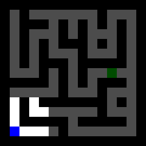

Project for the IFT6760C AI Safety class.

This repo contains the full code, some of the figures used in the report, as well as the tables (csv).

For the full table containing success rates for all models (61 models) on the evaluation set, refer to evals_all.csv in /eval_results folder.

The relevant code files are : 
- main.py : the overall training loop with model definitions
- MazeEnv.py : the code for the maze environment used here
- MazeGen.py : the code to generate the mazes

- others : code to generate the results in the report

